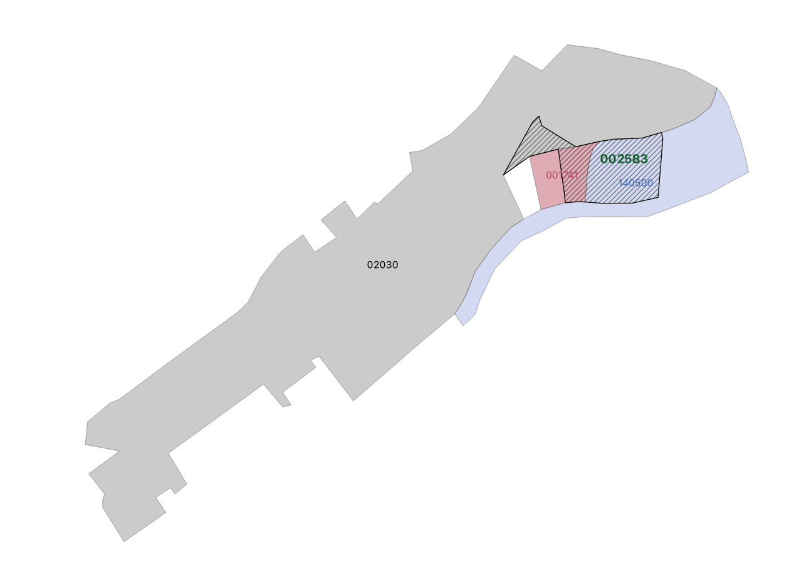
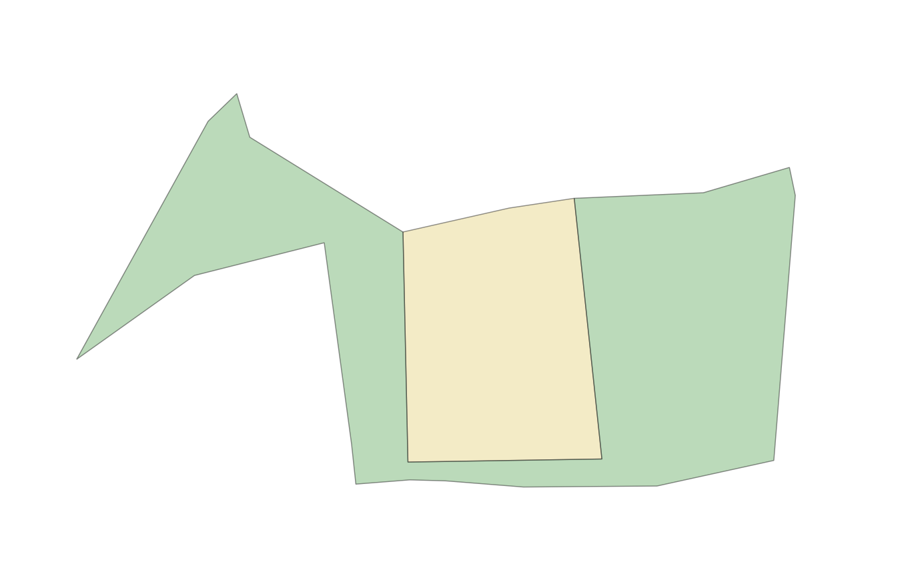
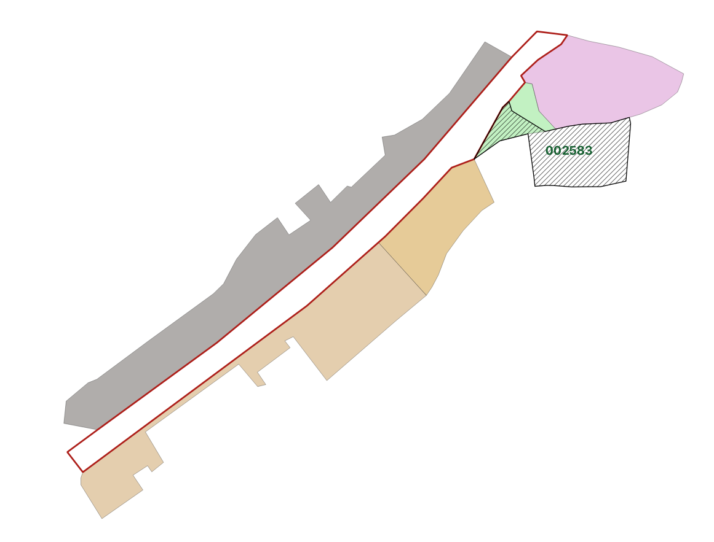
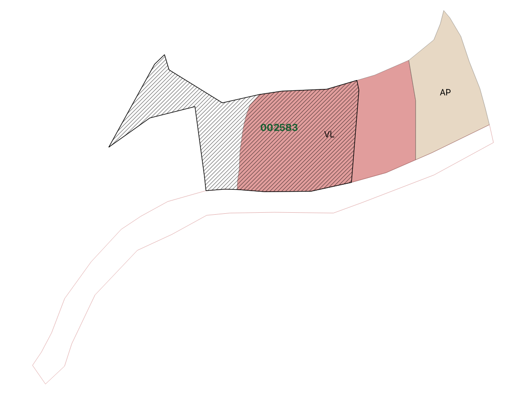
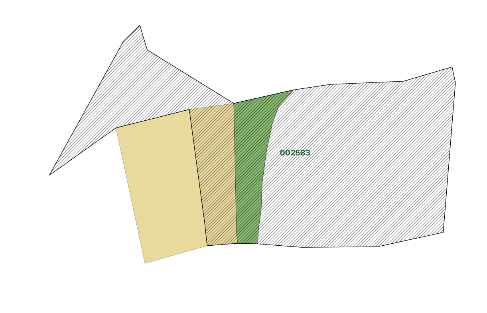

# Asemakaavamuutos

## Asemakaavamuutos, jossa kumotaan osittain kolme voimassaolevaa, Ryhtiin vietyä kaavaa

Esimerkissä ollaan viemässä Ryhtiin voimaan kuulutettua muutoskaavaa, jonka sisäinen tunnus on 002583. Esimerkki perustuu osittain todelliseen muutoskaavaan Vantaa Varistossa, mutta alueita ja käyttötarkoituksia on yksinkertaistettu esimerkkiä varten.

Alla olevassa kuvassa on esitetty muutoskaavan aluerajaus (viivoitettu alue) sekä osittain kumottavien kaavojen "AK-000001" (140500, sininen), "AK-000002" (02030, harmaa), "AK-000003" (001741, punainen) aluerajaukset:



Muutoskaavan omat VL- ja KT-käyttötarkoitusalueet:


Kaavamuutoksella kumotaan kaavasta AK-000002 (02030) VL-kaavakohde ```3f08a239-06e8-4a5f-b176-e376c5cc5e48``` osittain siten, että sen pohjois-osa jää jäljelle, ja länsiosa tulee osaksi muutoskaavan suurempaa VL-aluetta ```a95f8154-0e8d-43d3-8541-e733d22d808c```:



Kaavan AK-000001 (140500) osalta muutoskaavalla kumotaan osittain VL-kaavakohde ```2e2335c0-7584-44ee-a3fe-75ac5e0b13df``` siten, että sen itäosa jää jäljelle ja länsi-osa liitetään osaksi samaa muutoskaavan VL-aluetta ```a95f8154-0e8d-43d3-8541-e733d22d808c``` kuin kaavasta AK-00002 leikattu VL-alue:



Kolmannesta osittain kumottavasta kaavasta (AK-000003, 001741) kumotaan kokonaan VL-kaavakohde ```9a9b3b58-0d3b-4465-9e21-2fc7fb5bf795``` ja KT-alue ```64bdeacf-60cf-4601-875d-26b14272496e``` osittain siten, että sen länsialue jää jäljelle:


### Muutoskaava (002583)

YAML: [SpatialPlan-asemakaavamuutos.yml](./SpatialPlan-asemakaavamuutos.yml)

JSON: [SpatialPlan-asemakaavamuutos.md](./SpatialPlan-asemakaavamuutos.md) (generoitu automaattisesti)

### Osittain kumottava kaava (AK-000001, 140500)
YAML: [SpatialPlan-asemakaava-kumottava-140500.yml](./SpatialPlan-asemakaava-kumottava-140500.yml)

JSON: [SpatialPlan-asemakaava-kumottava-140500.md](./SpatialPlan-asemakaava-kumottava-140500.md) (generoitu automaattisesti)

### Osittain kumottava kaava (AK-000002, 02030)
YAML: [SpatialPlan-asemakaava-kumottava-02030.yml](./SpatialPlan-asemakaava-kumottava-02030.yml)

JSON: [SpatialPlan-asemakaava-kumottava-02030.md](./SpatialPlan-asemakaava-kumottava-02030.md) (generoitu automaattisesti)

### Osittain kumottava kaava (AK-000003, 001741)
YAML: [SpatialPlan-asemakaava-kumottava-001741.yml](./SpatialPlan-asemakaava-kumottava-001741.yml)

JSON: [SpatialPlan-asemakaava-kumottava-001741.md](./SpatialPlan-asemakaava-kumottava-001741.md) (generoitu automaattisesti)