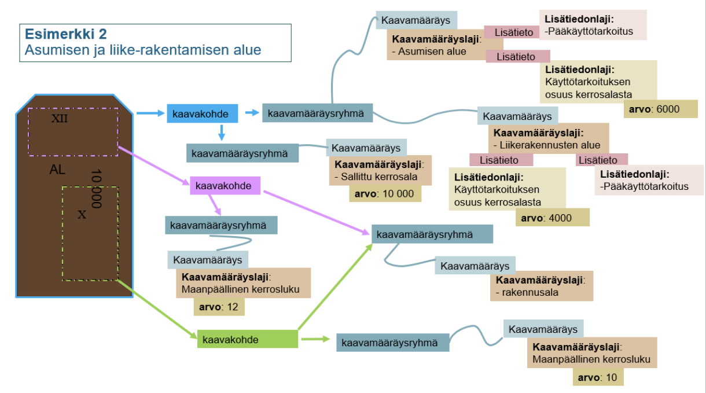
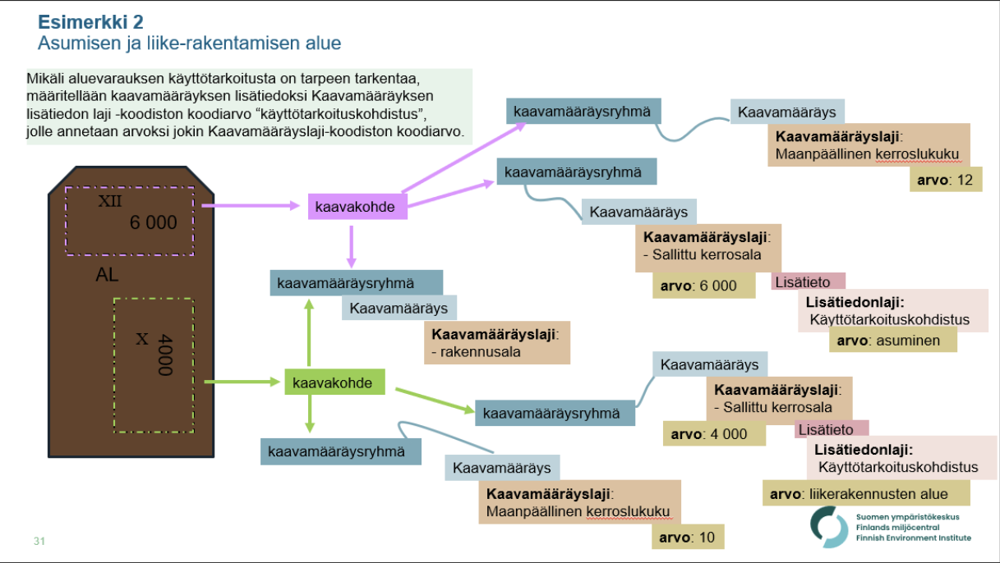

# Sallittu kerrosala

Esimerkkejä [Sallittu kerrosala](http://uri.suomi.fi/codelist/rytj/RY_Kaavamaarayslaji/code/sallittuKerrosala)-kaavamääräyslajin ja siihen liittyen lisätietojen käytöstä.

## SpatialPlan-kayttotarkoituksenOsuusKerrosalasta

YAML: [SpatialPlan-kayttotarkoituksenOsuusKerrosalasta.yml](./SpatialPlan-kayttotarkoituksenOsuusKerrosalasta.yml)

JSON: [SpatialPlan-kayttotarkoituksenOsuusKerrosalasta](./SpatialPlan-kayttotarkoituksenOsuusKerrosalasta.md) (generoitu automaattisesti)

## SpatialPlan-kayttotarkoituskohdistus

Esimerkissä on myös AL-alueen kaavakohde ja sen aluevaraus annettu, toisin kuin yo. kuvassa.

YAML: [SpatialPlan-kayttotarkoituskohdistus.yml](./SpatialPlan-kayttotarkoituskohdistus.yml)

JSON: [SpatialPlan-kayttotarkoituskohdistus](./SpatialPlan-kayttotarkoituskohdistus.md) (generoitu automaattisesti)

## SpatialPlan-useampiKayttotarkoituskohdistus

Variaatio esimerkistä "SpatialPlan-kayttotarkoituskohdistus" siten, että rakennusalalle X on sallittu rakentaa 2500 k-m2 liiketilaa ja 1500 k-m2 toimistotilaa. Määräys on toteutettu niin, että rakennusalaan X kohdistuvassa kaavamääräysryhmässä on kaksi Sallittu kerrosala -lajin kaavamääräystä, joissa molemmissa oma käyttötarkoituskohdistus.

YAML: [SpatialPlan-useampiKayttotarkoituskohdistus.yml](./SpatialPlan-useampiKayttotarkoituskohdistus.yml)

JSON: [SpatialPlan-useampiKayttotarkoituskohdistus](./SpatialPlan-useampiKayttotarkoituskohdistus.md) (generoitu automaattisesti)