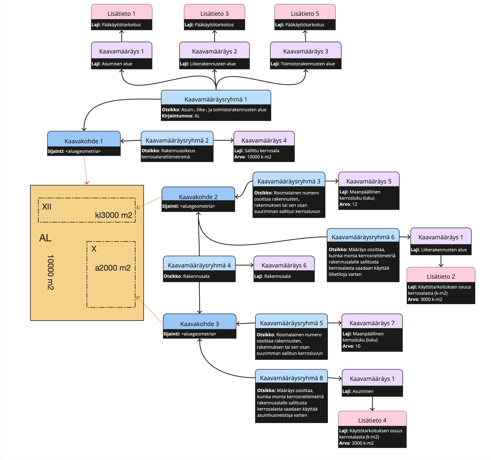

# Sallittu kerrosala

Esimerkkejä [Sallittu kerrosala](http://uri.suomi.fi/codelist/rytj/RY_Kaavamaarayslaji/code/sallittuKerrosala)-kaavamääräyslajin ja siihen liittyen lisätietojen käytöstä.

## SpatialPlan-kayttotarkoituksenOsuusKerrosalasta

AL-korttelin alueelle on kokonaisuudessa sallittu 10000 k-m2 rakennusoikeutta, ja siitä on asuminen-määräyksen lisätiedon "Käyttötarkoituksen osuus kerrosalasta" avulla osoitettu 6000 k-m2 asumiseen ja liikerakennustena alue -määräyksen lisätiedon "Käyttötarkoituksen osuus kerrosalasta" avulla osoitettu 4000 k-m2 liikerakentamiseen. Kaavassa ei oteta kantaa miten kerrosalat tai niiden käyttö sijoittuvat rakennnusaloille.

YAML: [SpatialPlan-kayttotarkoituksenOsuusKerrosalasta.yml](./SpatialPlan-kayttotarkoituksenOsuusKerrosalasta.yml)

JSON: [SpatialPlan-kayttotarkoituksenOsuusKerrosalasta](./SpatialPlan-kayttotarkoituksenOsuusKerrosalasta.md) (generoitu automaattisesti)

## SpatialPlan-kayttotarkoituskohdistus

AL-korttelin alueelle aluevaraukseen ei ole osoitettu lainkaan rakennusoikeutta, vaan rakennusoikeus on osoitettu suoraan rakennusaloille. Molempien "Sallittu kerrosala" -määräysten lisätiedon "Käyttötarkoituskohdistus" avulla ko. rakennusalojen rakennusoikeus on osoitettu pelkästään liikerakentamiseen (ylempi rakennusala) tai asumiseen (alempi rakennusala).

Huomaa, että karttavisualisoinnissa on käytetty Katja-asetuksessa määrittelemätöntä merkintöjä "4000 m2 (A)" ja "6000 m2 (KL)", koska Katja-asetuksessa ei ole mitään määrittelyä salllitun kerrosalan käyttötarkoituskohdistukselle.

YAML: [SpatialPlan-kayttotarkoituskohdistus.yml](./SpatialPlan-kayttotarkoituskohdistus.yml)

JSON: [SpatialPlan-kayttotarkoituskohdistus](./SpatialPlan-kayttotarkoituskohdistus.md) (generoitu automaattisesti)

## SpatialPlan-useampiKayttotarkoituskohdistus

Variaatio esimerkistä "SpatialPlan-kayttotarkoituskohdistus" siten, että alemmalle rakennusalalle on sallittu sekä 2500 k-m2 asuinrakentamista että 1500 k-m2 liiketilaa ja ylemmällä rakennusalalle 6000 k-m2 asuinrakentamista. Määräys on toteutettu niin, että alempaan rakennusalaan kohdistuu kavamääräysryhmään, joissa molemmissa Sallittu kerrosala -lajin kaavamääräys, jossa käyttötarkoituskohdistus -lisätieto.

Huomaa, että karttavisualisoinnissa on käytetty Katja-asetuksessa määrittelemätöntä merkintöjä "4000 m2 (A)" ja "6000 m2 (KL)", koska Katja-asetuksessa ei ole mitään määrittelyä salllitun kerrosalan käyttötarkoituskohdistukselle.

YAML: [SpatialPlan-useampiKayttotarkoituskohdistus.yml](./SpatialPlan-useampiKayttotarkoituskohdistus.yml)

JSON: [SpatialPlan-useampiKayttotarkoituskohdistus](./SpatialPlan-useampiKayttotarkoituskohdistus.md) (generoitu automaattisesti)

## SpatialPlan-osaRakennusalastaVarattuKayttotarkoitukseen

AL-korttelin alueelle aluevaraukseen ei ole osoitettu lainkaan rakennusoikeutta, vaan rakennusoikeus on osoitettu suoraan rakennusaloille. Alemmalle rakennusalalle on sallittu 4000 k-m2 ja ylemmälle rakennusalalle 6000 k-m2 rakennusoikeutta ilman käyttötarkoituskohdistusta. Korttelin sekoitettu käyttötarkoitus AL pätee. Rakennusalalle X sallitusta kokonaiskerrosalasta (4000 k-m2) on erikseen varattu asumiselle 2000 k-m2 (vastaa merkintää "a2000 m2") ja rakennusalan XII sallitusta kokonaiskerrosalasta (6000 k-m2) liikerakentamiselle 3000 k-m2 (vastaa Katja-asetuksessa määrittelemätöntä merkintää "kl3000 m2").

YAML: [SpatialPlan-osaRakennusalastaVarattuKayttotarkoitukseen.yml](./SpatialPlan-osaRakennusalastaVarattuKayttotarkoitukseen.yml)

JSON: [SpatialPlan-osaRakennusalastaVarattuKayttotarkoitukseen](./SpatialPlan-useampiKayttotarkoituskohdistus.md) (generoitu automaattisesti)

## SpatialPlan-osaRakennusalastaVarattuKayttotarkoitukseenEiRakennusalakohtaistaRakennusoikeutta

AL-korttelin alueelle on kokonaisuudessa sallittu 10000 k-m2 rakennusoikeutta jakamatta sitä rakennusalojen kesken. Rakennusalalle X sallitusta kokonaiskerrosalasta on varattu asumiselle 2000 k-m2 (vastaa merkintää "a2000 m2") ja rakennusalan XII sallitusta kokonaiskerrosalasta liikerakentamiselle 3000 k-m2 (vastaa Katja-asetuksessa määrittelemätöntä merkintää "kl3000 m2").

YAML: [SpatialPlan-osaRakennusalastaVarattuKayttotarkoitukseenEiRakennusalakohtaistaRakennusoikeutta.yml](./SpatialPlan-osaRakennusalastaVarattuKayttotarkoitukseenEiRakennusalakohtaistaRakennusoikeutta.yml)

JSON: [SpatialPlan-osaRakennusalastaVarattuKayttotarkoitukseenEiRakennusalakohtaistaRakennusoikeutta](./SpatialPlan-osaRakennusalastaVarattuKayttotarkoitukseenEiRakennusalakohtaistaRakennusoikeutta.md) (generoitu automaattisesti)